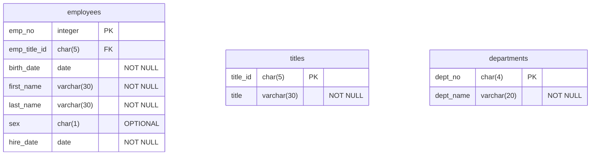
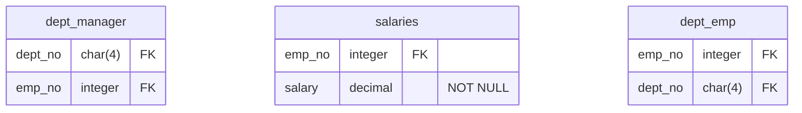

# Module-9-SQL-Assignment

## Introduction
The SQL Challenge Assignment is detailed in this README.md file. The assignment is completed in three parts:
1. Data Modelling
2. Data Engineering
3. Data Analysis

### Files
The SQL code used for this assignment is stored in the 'code' folder. The **'Employees Schema.sql'** file contains the code to create and relate the tables with primary and foreign keys. The **'Quries.sql'** file holds the code for the eight questions asked in the data analysis section. The 'data' folder contains the six CSV files used to populate the respective tables. The 'images' folder includes the Entity Relationship diagram and output tables from pgAdmin, which will be referenced in this document.

## Data Modelling
An Entity Relationship Diagram (ERD) was created using the online diagramming tool [Lucid Charts](https://www.lucidchart.com/pages/). The CSV files from the 'data' folder were used to create the ERD entities, attributes, and keys. There are six tables in total in this database.


## Data Engineering

### Creating tables and their attributes
Six tables were created in an 'Employees' Database by importing the source data from the provided CSV files in the 'data' folder. The titles of the CSV files became the names of the tables (entities) in the database, and each of the columns in the CSV file became the attributes of each table. The block below shows the SQL code used to create the tables in PostgreSQL.
https://github.com/drchid1/Module-9-SQL/blob/7a5a67ddfd325c03ab08581d08847ffc625e894e/code/Employees%20Schema.sql#L9-L52

### Data types and Value lengths
Five different data types were used to build the tables.

- ```INTEGER``` These were used for the 'Employment Number', which only consisted of numbers with no decimals.
- ```DATE``` The date type was used to hold each employee's birth date and the date the company hired them. The date format in the CSV file was 'YYYY-DD-MM'.
- ```CHAR``` The CHAR was used to hold the 'Title ID', 'Sex' and the 'Department Number' over VARCHAR. This allows for a consistent data sizer and can improve performance through simplified memory allocation. The 'Title ID' needed five characters, containing a single letter followed by four numeric digits. The 'Department Number' started with the letter 'd' and had three numeric digits, requiring a character length of four. The 'sex' attribute was given one character length, as they have been recorded using a single character. Another data type that could be used to store 'sex' is ```ENUM```.
- ```VARCHAR``` The VARCHAR is used to record 'First Name', 'Last Name' and 'Employee Title'. They have all been given 30 characters, which should be ample for this data set.
- ```DECIMAL``` Salary in this data set has all been shown as integers; however, salary is likely to involve at least two decimal spaces if the currency is Dollars or Pounds. Hence, the DECIMAL data type up to two decimal places was chosen.

### Primary and Foreign Keys
Ideally, all tables in a database should have Primary Keys. In this Employees Database, six tables and three main tables (employees, titles and departments) have been assigned Primary Keys. The other three tables (dept_manager, salaries and dept_emp tables) only have two attributes, and they are linked to the different tables through Foreign Keys. The dept_emp table has two foreign keys, behaving like a junction table and bridging the data between the employees and departments table. The dept_manager table again has two foreign keys linking the employees and departments table, but it only has records of all the managers in the organisation.
Primary Keys are linked through Foreign Keys, creating a relationship between tables. The Primary Keys and Foreign Keys have been given similar naming conventions in the database for traceability except for the link between the employees table and the titles table, where the naming of the original columns in the CSV file was different, and this difference was preserved in the database.

### Constraints
The tables below show all the attributes in the database and their constraints. Once a Primary Key and Foreign Key have been assigned to an attribute, it has the constraints of having a unique value and not being a NULL value. All non-key attributes have been constrained with not having a NULL value except for the 'sex' attribute. All data collected in a database should have relevance, and for our current purpose, there is no requirement for 'sex'; however, this may be necessary in the future if, for example, an analysis is needed to establish the difference in salary between men and women and having this field as NOT NULL would be significant. In the 'Sex' attribute, the data for all employees were recorded as 'M' for males and 'F' for females. Some employees may feel uncomfortable being forced to choose between a binary choice of Man and Woman. Another single letter code like 'X' could potentially be used for employees who do not wish to disclose their 'sex'. Still, the integrity of this would be weak as it cannot differentiate between whether the employee did not want to declare their sex or they would like to describe it as something else, such as 'Non-Binary'. Options using a single character are limited but have been convenient for this specific dataset. We have opted to keep this attribute optional for this dataset as some employees may not feel comfortable being forced to describe their 'sex' using a single character, and it can also lead to misinterpretation. While the CHAR data type has been used in this exercise for convenience, ideally, a data type such as ENUM may be more appropriate.




## Data Analysis

SQL queries were written to interrogate the employee's database for the eight questions asked, and the output for each query has been included.

### Question 1
```SQL
-- QUESTION 1: List the employee number, last name, first name, sex, and salary of each employee.
-- All the information for this query can be found in the employees table and the salaries table


SELECT employees.emp_no, employees.first_name, employees.last_name, employees.sex, salaries.salary
FROM employees AS employees
JOIN salaries AS salaries
ON salaries.emp_no = employees.emp_no;
```


---
### Question 2
```SQL
-- QUESTION 2: List the first name, last name, and hire date for the employees who were hired in 1986.
-- All the information for this query is available in the employees table


SELECT first_name, last_name, hire_date
FROM employees
WHERE EXTRACT(YEAR FROM hire_date) = 1986;
```


---
### Question 3
```SQL
-- QUESTION 3: List the manager of each department along with their department number, department name,
-- employee number, last name, and first name.
-- The information required for this query can be found in employees, dept_manager and departments table.


SELECT employees.emp_no AS "Employee Number",
        employees.first_name || ' ' || employees.last_name AS "Manager Name",
        departments.dept_name AS "Department Name",
        departments.dept_no AS "Department Number"
FROM employees as employees
JOIN dept_manager
ON dept_manager.emp_no = employees.emp_no
        JOIN departments AS departments
        ON departments.dept_no = dept_manager.dept_no;
```
In this output, the first and last names have been concatenated for easier reading of the manager's names. The Column names have also been re-labelled for easier reference.


---
### Question 4
```SQL
-- QUESTION 4: List the department number for each employee along with that employee’s employee number, last name,
-- first name, and department name.
-- The information for this query will come from employees, dept_emp and departments table.

-- Creation of a VIEW called 'employee_department'
CREATE VIEW employee_department AS
SELECT employees.emp_no AS "Employee Number",
        employees.first_name AS "Employee First Name",
        employees.last_name AS "Employee Last Name",
        departments.dept_no AS "Department Number",
        departments.dept_name AS "Department Name"
FROM employees AS employees
JOIN dept_emp
ON dept_emp.emp_no = employees.emp_no
        JOIN departments
        ON departments.dept_no = dept_emp.dept_no;

-- Running the query for all employees from View
SELECT * FROM employee_department;
```


```SQL
-- On review of the output there was staff working in more than one department.
-- Another query was run to find staff working in more than 1 department.
-- Running query to find duplicates from View
-- ie: how many staff work in more than 1 department


SELECT "Employee Number", COUNT(*) AS "Number of departments working for"
FROM employee_department
GROUP BY "Employee Number"
HAVING COUNT(*) > 1
ORDER BY "Number of departments working for" DESC;
```
There are around 31,579 employees (see row total in image) who work in more than one department, and the maximum number of departments worked by any employee is 2 


---
### Question 5
```SQL
-- QUESTION 5: List first name, last name, and sex of each employee whose first name is Hercules
-- and whose last name begins with the letter B.
-- For this query all the information is available in the employees table


SELECT first_name, last_name, sex
FROM employees
WHERE first_name = 'Hercules' AND last_name LIKE 'B%';
```
There are 20 employees with the first name 'Hercules' and a surname starting with the letter 'B'


---
### Question 6
```SQL
-- QUESTION 6: List each employee in the Sales department, including their employee number, last name, and first name.
-- We can use the department name 'Sales' or the department number 'd007'. In this query we will use the department name.


SELECT *
FROM employee_department
WHERE "Department Name" = 'Sales';
```
There are 52,245 staff working in the sales department.


---
### Question 7
```SQL
-- QUESTION 7: List each employee in the Sales and Development departments, including their employee number, last name,
-- first name, and department name.
-- For a change, we will use the department number, which is the primary key to make this query. Using the primary key can
-- potentially make the query faster. The Sales department has the number 'd007' and Development department has the number 'd005'


SELECT *
FROM employee_department
WHERE "Department Number" = 'd007' OR "Department Number" = 'd005'; 
```
There are 137,952 staff working in the sales and development department.


---
### Question 8
```SQL
-- QUESTION 8: List the frequency counts, in descending order, of all the employee
-- last names (that is, how many employees share each last name).


SELECT last_name AS "Surname", COUNT(last_name) AS "Number of Staff with the same Surname"
FROM employees
GROUP BY last_name
ORDER BY "Number of Staff with the same Surname" DESC;
```
The most popular surname of employees working in this organisation is 'Baba'.


---


