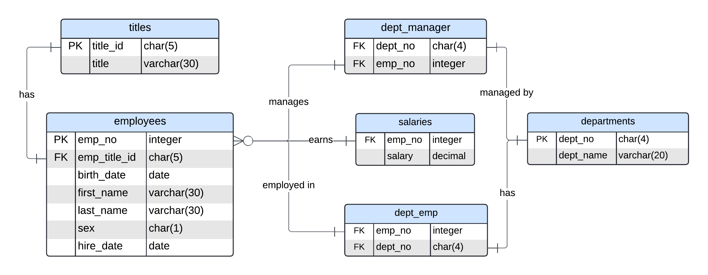

# Module-9-SQL-Assignment

## Introduction
The SQL Challenge Assignment is detailed in this README.md file. The assignment is completed in three parts:
1. Data Modelling
2. Data Engineering
3. Data Analysis

### Files
The SQL code used for this assignment is stored in the 'code' folder. The **'Employees Schema.sql'** file contains the code to create and relate the tables with primary and foreign keys. The **'Quries.sql'** file holds the code for the eight questions asked in the data analysis section. The 'data' folder contains the six CSV files used to populate the respective tables. The 'images' folder includes the diagrams and output tables from pgAdmin, which will be referenced in this document.

## Data Modelling
An Entity Relationship Diagram (ERD) was created using the online diagramming tool [Lucid Charts](https://www.lucidchart.com/pages/). The CSV files from the 'data' folder were used to create the ERD entities, attributes, and keys. There are six tables in total in this database.


## Data Engineering

### Creating tables and their attributes
Six tables were created in an 'Employees' Database by importing the source data from the provided CSV files in the 'data' folder. The titles of the CSV files became the names of the tables (entities) in the database, and each of the columns in the CSV file became the attributes of each table. The block below shows the SQL code used to create the tables in PostgreSQL.
https://github.com/drchid1/Module-9-SQL/blob/7a5a67ddfd325c03ab08581d08847ffc625e894e/code/Employees%20Schema.sql#L9-L52

### Data types and Value lengths
Five different data types were used to build the tables.

- ```INTEGER``` These were used for the 'Employment Number', which only consisted of numbers with no decimals.
- ```DATE``` The date type was used to hold each employee's birth date and the date the company hired them. The date format in the CSV file was 'YYYY-DD-MM'.
- ```CHAR``` The CHAR was used to hold the 'Title ID', 'Sex' and the 'Department Number' over VARCHAR. This allows for a consistent data sizer and can improve performance through simplified memory allocation. The 'Title ID' needed five characters, containing a single letter followed by four numeric digits. The 'Department Number' started with the letter 'd' and had three numeric digits, requiring a character length of four. The 'sex' attribute was given one character length, as they have been recorded using a single character. Another data type that could be used to store 'sex' is ```ENUM```.
- ```VARCHAR``` The VARCHAR is used to record 'First Name', 'Last Name' and 'Employee Title'. They have all been given 30 characters, which should be ample for this data set.
- ```DECIMAL``` Salary in this data set has all been shown as integers; however, salary is likely to involve at least two decimal spaces if the currency is Dollars or Pounds. Hence, the DECIMAL data type up to two decimal places was chosen.

### Primary and Foreign Keys


## Data Analysis
